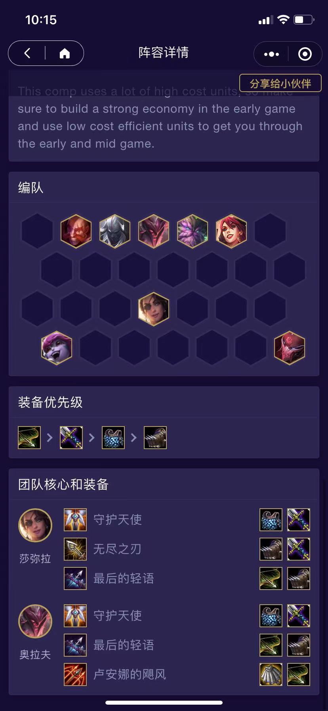
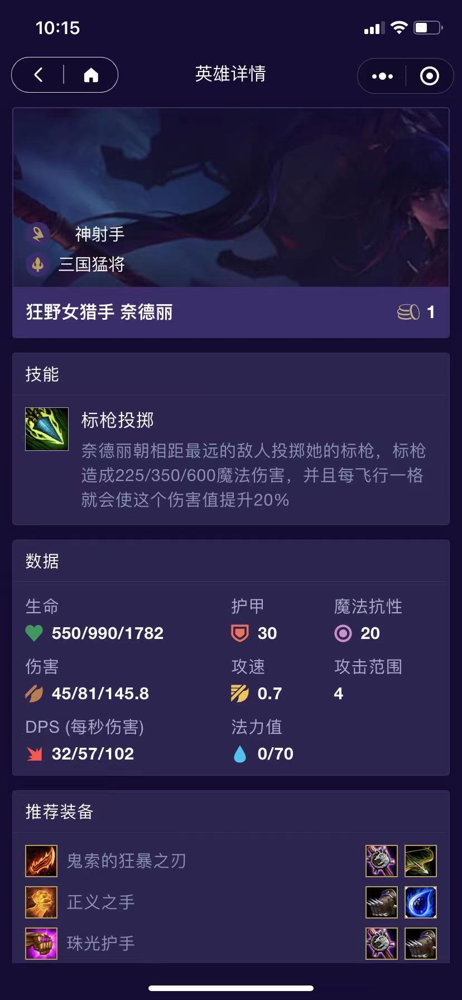
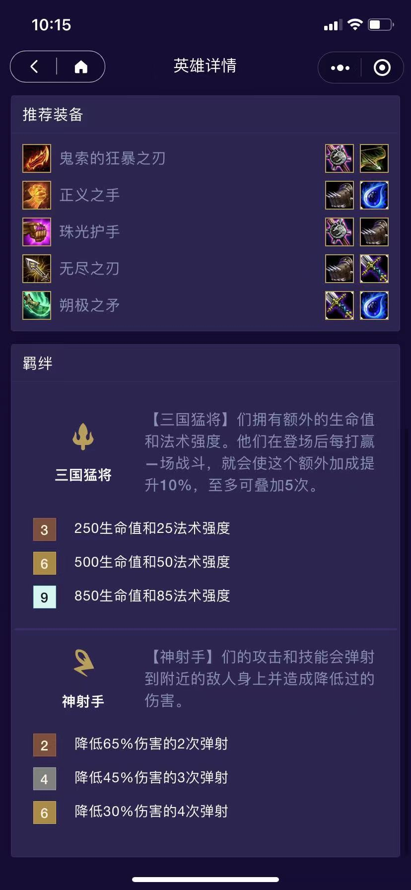
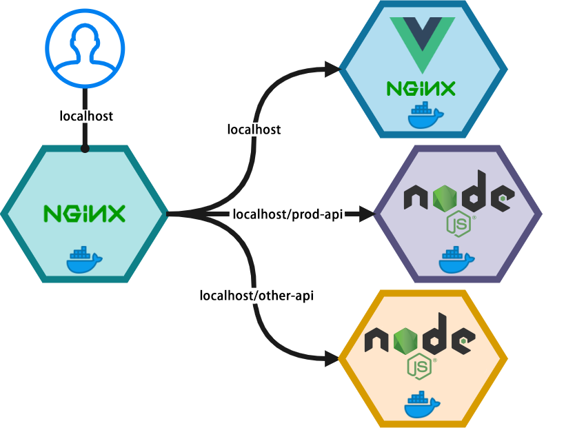

# 云顶 98K

全栈项目使用 Docker compose 在本地与 Nginx, Hexo, MySQL, Node 运行在 Docker 中。供大家学习与参考。


## 微信小程序截图

> 微信小程序搜索【云顶 98k】体验






## 博客截图


体验地址 [https://www.manito.fun/](https://www.manito.fun/)

## 准备

在运行前你需要做一些事情

- api-service 接口服务
  - 修改数据库账户密码，搜索：`你数据库的密码`、`你数据库的账户` 并替换为你自己的数据库账户密码
  - 执行 `i-love-auto-chess.sql` 脚本 初始化数据库和数据
- miniapp 小程序
  - 将 `miniapp/images` 整个文件夹上传到你自己的小程序云开发的 CDN 中，并修改 `app.ts` 中 关于云开发相关配置
  - 修改 `miniapp/utils/http.ts` 中的接口地址 `BASE_URL`
- reverse-proxy 反向代理
  - 将 `nginx.conf` 中的 url 配置成你自己的网站域名
  - 如需开启 https 则需生成对应的网站证书
- web-blog 博客
  - 根据 `/web-blog/themes/hipaper/README.cn.md` 提供的教程修改你自己的博客配置

## 运行

假设您已经安装了 Docker 和 Docker Compose。为了开始，请确保将此项目克隆到 Docker 主机上。在主机上创建目录。

```bash
git clone https://github.com/OLIVERgZzy/yunding98k.git
```

一旦你克隆了项目到你的主机，我们现在可以开始我们的演示项目。轻松！导航到克隆项目所在的目录。从此目录运行以下命令

```bash
sudo docker-compose build
sudo docker-compose up -d
```

## 反向代理


